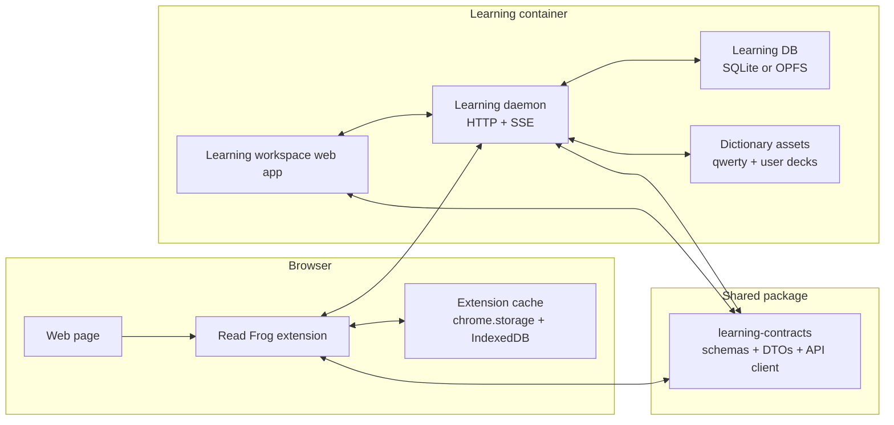

# Read Frog Learning Container Redesign

Status: proposal for the `feature/learning-loop` branch.
Last verified: 2026-06-01.

This document redesigns the learning loop around three upstream projects:

- `mengxi-ream/read-frog` upstream: browser extension, page translation, selection tools, provider configuration.
- `RealKai42/qwerty-learner` upstream: typing-first vocabulary practice, dictionary catalog, chapter progress, mistake analytics.
- `nexu-io/open-design` reference: local-first app split into a web workspace, a local daemon, and shared contracts.

The intent is to keep Read Frog easy to rebase onto upstream while letting the learning workspace become a richer product surface than an extension options page can reasonably support.

## Decision Summary

1. Split the learning workspace out of the extension into a containerized local app.
2. Keep the extension focused on capture, page translation, light controls, and a sync bridge.
3. Add a shared contract package as the only stable boundary between extension, container app, and daemon.
4. Make the local daemon the source of truth for learning data when it is available.
5. Keep an offline extension cache/projection so page translation and selection save still work when the container is not running.
6. Integrate qwerty-learner by porting its domain model and dictionary assets intentionally, not by embedding the whole upstream app.
7. Redesign the UI as a dense learning cockpit inspired by open-design's workspace/daemon split, not as the current card-heavy options page.
8. Maintain upstream compatibility by isolating fork code behind narrow extension points and keeping upstream files close to stock.

## Current State Findings

The current branch proves the learning direction is useful, but it is not a sustainable shape.

- The learning page is monolithic: `src/entrypoints/options/pages/learning/index.tsx` is about 1500 lines and owns dashboard, manual add, review, qwerty typing, import/export, GitHub sync, settings, and data loading.
- Learning changes are spread across high-churn extension surfaces: options routing/sidebar, popup, selection toolbar, config schemas, Dexie schema, translate variants, i18n, and bundled public dictionaries.
- Qwerty dictionaries alone add more than 100k lines of JSON to the extension payload.
- Some current source strings are mojibake/garbled, which makes the options page risky to keep extending.
- `git diff --name-status upstream/main..HEAD` shows that a future upstream rebase would repeatedly conflict around extension UI and config files.
- The current selective translation implementation is a useful spike, but it only uses a simple local word lookup and status check. It does not yet model confidence, recency, phrase mastery, page context, or daemon/container availability.

## External Research Notes

### read-frog upstream

Verified upstream main:

- Repository: `https://github.com/mengxi-ream/read-frog`
- Commit: `c9b157ad56a42d2ba691cbbbbc9859d378802f5d`
- Date: 2026-05-28
- Subject: `fix(providers): migrate 302 ai configs to custom provider (#1618)`

Read Frog should remain the extension shell. The fork should avoid turning it into the full learning app because browser extension entrypoints and store review constraints are a poor fit for a large local-first workspace.

### qwerty-learner

Verified upstream HEAD:

- Repository: `https://github.com/RealKai42/qwerty-learner`
- Commit: `2498f753aaf955645f466664d3972c2c7d29dd55`
- Date: 2026-03-09
- License: GPL-3.0

Important concepts to reuse:

- Dictionary resources: `DictionaryResource`, `Dictionary`, `Word`, `WordWithIndex`.
- Chapter length: 20 words per chapter.
- Typing state machine: chapter setup, per-word progress, wrong/correct reporting, timers, looping, skip, review mode.
- Records:
  - `wordRecords`: word, dict, chapter, timing, wrong count, per-letter mistakes.
  - `chapterRecords`: dict, chapter, time, correct/wrong counts, word count, correct word indexes.
  - `reviewRecords`: dict, resume index, generated review words, finished state.
- Import/export: Dexie export/import compressed with gzip.
- Analytics pages: error book, daily activity, speed/accuracy and wrong-key analysis.

Integration implication: because both Read Frog and qwerty-learner are GPL-3.0, code and data reuse is license-compatible inside this fork, but copied code/assets should retain attribution and be isolated under a clearly named package or import script.

### open-design

Verified upstream HEAD:

- Repository: `https://github.com/nexu-io/open-design`
- Commit: `a1f01e6fb7fdc823d71b00568bb9b2fff3b71f08`
- Date: 2026-05-31
- License: Apache-2.0

Useful architectural ideas:

- Local-first product shape: web app plus local daemon.
- Shared `packages/contracts` for web/daemon DTOs.
- Daemon owns local privileged data and exposes HTTP `/api/*` plus SSE.
- Web app consumes the daemon through typed request/response boundaries.
- App UI is a real workspace, while runtime/files/data live behind an API boundary.

We should borrow the split, not the implementation. The learning app needs smaller scope: SQLite/OPFS data, qwerty practice, SRS, translation mastery projection, and extension bridge.

## Target Architecture



### Components

`extension`

- Stays in the current WXT app.
- Owns content scripts, page translation, selection toolbar, popup controls, and options links.
- Calls one local `LearningBridgeService` registered from the background via `@webext-core/proxy-service`.
- Maintains only a small projection of learning data needed for fast page translation.

`apps/learning-web`

- New container web app, preferably Vite + React to stay close to current Read Frog/qwerty technology.
- Owns the full learning workspace UI.
- Runs in the container and talks to the daemon through the contract client.

`apps/learning-daemon`

- New local service.
- Exposes `http://127.0.0.1:<port>/api/*`.
- Owns learning data, qwerty records, SRS scheduling, mastery projection, import/export, and sync.
- Emits SSE events for progress updates and extension sync invalidation.

`packages/learning-contracts`

- Pure TypeScript package with zod schemas, DTOs, error types, event unions, and generated/fetch-based API helpers.
- Must not import WXT, React, Dexie, SQLite, browser APIs, or daemon internals.

`packages/qwerty-domain`

- Ported qwerty dictionary types, normalizers, chapter slicing, typing reducer, scoring, and record aggregation.
- No UI dependency.
- Keeps upstream attribution and license note.

## Proposed Repository Layout

The current repo is not a pnpm workspace. The split can be introduced in two stages.

Stage 1 keeps risk low:

```text
src/
  utils/learning-bridge/
  utils/learning-projection/
packages/
  learning-contracts/
  qwerty-domain/
apps/
  learning-web/
  learning-daemon/
```

Add `pnpm-workspace.yaml` only when the new apps/packages are ready to build. Until then, contracts can be developed under `src/utils/learning-contracts` and moved in one mechanical patch.

Stage 2 converts the fork into a workspace:

```yaml
packages:
  - "."
  - "apps/*"
  - "packages/*"
```

Root package remains the extension package. The extension's existing scripts keep working.

## Data Ownership

The daemon owns canonical data when available. The extension keeps a projection.

### Canonical daemon tables

`learning_items`

- `id`
- `kind`: `word | phrase | sentence | paragraph`
- `text`
- `normalizedText`
- `language`
- `status`: `new | learning | review | mature | archived`
- `source`: `selection | page | qwerty | manual | import`
- `sourceUrl`
- `sourceTitle`
- `context`
- `definition`
- `examples`
- `tags`
- `createdAt`
- `updatedAt`

`mastery_cards`

- `itemId`
- `algorithm`: `fsrs`
- `state`
- `stability`
- `difficulty`
- `dueAt`
- `lastReviewAt`
- `reviewCount`
- `lapses`
- `consecutivePasses`
- `confidence`: 0 to 1

`review_logs`

- `id`
- `itemId`
- `sessionId`
- `mode`: `srs | qwerty | comprehension | manual`
- `rating`: `again | hard | good | easy`
- `correct`
- `createdAt`
- `payload`

`qwerty_word_records`

- `id`
- `itemId`
- `dictId`
- `chapterIndex`
- `wordIndex`
- `word`
- `input`
- `correct`
- `accuracy`
- `durationMs`
- `letterTimings`
- `mistakes`
- `createdAt`

`qwerty_chapter_records`

- `id`
- `dictId`
- `chapterIndex`
- `durationMs`
- `wordCount`
- `correctCount`
- `wrongCount`
- `correctWordIndexes`
- `wordRecordIds`
- `createdAt`

`dictionary_entries`

- `dictId`
- `wordIndex`
- `name`
- `trans`
- `usphone`
- `ukphone`
- `notation`
- `normalizedText`

`sync_cursors`

- `clientId`
- `lastEventId`
- `lastSyncedAt`
- `projectionVersion`

### Extension projection

The extension cache should be small and queryable:

```ts
interface MasteryProjectionEntry {
  normalizedText: string
  kind: "word" | "phrase"
  status: "unknown" | "learning" | "review" | "mature" | "archived"
  confidence: number
  dueAt?: string
  definition?: string
  updatedAt: string
}
```

This projection is enough for page translation and selection toolbar badges. The extension does not need the full review history.

## API Contract Sketch

All endpoints are versioned so the extension can detect incompatible daemon builds.

```text
GET  /api/v1/health
POST /api/v1/auth/pair/start
POST /api/v1/auth/pair/confirm

GET  /api/v1/projection?since=<eventId>
GET  /api/v1/projection/terms?terms=a,b,c
GET  /api/v1/events

POST /api/v1/capture/selection
POST /api/v1/capture/page-context

GET  /api/v1/items
POST /api/v1/items
PATCH /api/v1/items/:id
POST /api/v1/items/:id/review

GET  /api/v1/qwerty/dictionaries
GET  /api/v1/qwerty/dictionaries/:id/chapter/:chapterIndex
POST /api/v1/qwerty/records/word
POST /api/v1/qwerty/records/chapter

GET  /api/v1/export
POST /api/v1/import
POST /api/v1/sync/github
```

SSE event union:

```ts
type LearningEvent =
  | { type: "projection.updated"; eventId: string; changedTerms: string[] }
  | { type: "item.updated"; eventId: string; itemId: string }
  | { type: "qwerty.session.finished"; eventId: string; sessionId: string }
  | { type: "sync.finished"; eventId: string; result: "ok" | "error" }
```

## Extension-Daemon Handshake

The bridge must be safe enough for localhost use without making setup painful.

1. Daemon starts on `127.0.0.1` only, never `0.0.0.0`.
2. Daemon writes a pairing token under a local data directory, and shows it in the learning web UI.
3. Extension opens `http://127.0.0.1:<port>/pair?extensionId=<id>`.
4. User confirms pairing in the container UI.
5. Daemon returns a scoped token to the extension.
6. Extension stores token in extension storage.
7. Every bridge request sends `Authorization: Bearer <token>`.
8. Daemon validates `Origin` and CORS:
   - allow `chrome-extension://<paired-extension-id>`
   - allow `moz-extension://<paired-extension-id>`
   - allow the local learning web origin
9. If the daemon is unavailable, the extension queues mutations locally and retries.

This avoids accepting arbitrary localhost web pages as writers.

## Offline Behavior

The extension must remain useful without the container.

- Page translation uses the last projection snapshot.
- Selection saves are queued in extension IndexedDB with a `pendingSync` flag.
- Popup shows bridge status: connected, offline, pairing required, or incompatible.
- Opening the learning workspace from the extension should:
  - open the local web app if available;
  - otherwise show a short setup page with container start/load instructions.

## Selective Translation Design

The goal is not simply "skip mastered words". It is to translate according to the learner's current mastery.

### Pipeline

1. Segment candidate text into terms:
   - English words through a tokenizer/lemmatizer.
   - Phrases from saved learning items and dictionary phrase entries.
   - Sentence/paragraph items only when exact or high-confidence fuzzy match is available.
2. Resolve each candidate against the projection:
   - exact normalized match
   - lemma/stem match
   - phrase match before word match
3. Score each term:
   - `masteryScore = confidence`
   - lower score if due or overdue
   - lower score if recent qwerty mistakes exist
   - higher score if last reviews were easy/good and not due
4. Decide display mode:
   - `masteryScore >= 0.86` and not due: hide translation
   - `0.55 <= masteryScore < 0.86`: show hint or compact definition
   - `< 0.55` or unknown high-value term: show full definition
5. Build translation output:
   - Current "term: definition" summary can remain as the first milestone.
   - Later, annotate inline terms in the translated wrapper.

### Required settings

```ts
interface LearningTranslationSettings {
  enabled: boolean
  maxTermsPerParagraph: number
  masteredThreshold: number
  hintThreshold: number
  includeDueMastered: boolean
  unknownTermPolicy: "dictionary" | "none" | "top-frequency"
  displayMode: "summary" | "inline" | "bilingual-lite"
}
```

### Cache key impact

Translation cache hashes must include:

- projection version
- learning translation settings
- display mode
- relevant term statuses

Otherwise a paragraph can keep showing stale translations after mastery changes.

## Qwerty Integration Strategy

Do not embed qwerty-learner as an iframe or copy its whole app into the options page.

Port these parts into `packages/qwerty-domain`:

- dictionary resource schema
- word normalization
- chapter slicing
- typing reducer/state machine
- scoring and mistake logging
- word/chapter record aggregation
- import/export compatibility helpers

Rebuild UI in the learning workspace:

- keep the fast type-to-progress interaction;
- keep chapter practice and review mode;
- add a "from my reading" deck generated from Read Frog captures;
- add wrong-key analysis and error book;
- map qwerty records into the shared mastery model.

Dictionary asset plan:

1. Start with the six dictionaries already imported in this fork.
2. Move them out of the extension package into the learning container assets.
3. Add an import script that can pull selected qwerty upstream dictionaries and generate a manifest.
4. Keep a small extension fallback dictionary only if needed for offline selective translation.

## UI Redesign

The learning workspace should feel like an operational cockpit for language learning, not a marketing dashboard.

### Layout

```text
┌──────────────────────────────────────────────────────────────┐
│ Top bar: connection, active deck, sync, settings              │
├───────────────┬───────────────────────────────┬──────────────┤
│ Left rail      │ Main work surface             │ Right panel   │
│ Today          │ Practice / Reading / Review   │ Context       │
│ Inbox          │ Qwerty typing stage           │ Mastery card  │
│ Decks          │ Article terms                 │ Recent logs   │
│ Error book     │                               │               │
│ Analytics      │                               │               │
└───────────────┴───────────────────────────────┴──────────────┘
```

### Primary screens

`Today`

- Due reviews, weak terms, qwerty chapter to resume, reading captures to triage.
- Dense list, keyboard-first, no nested cards.

`Practice`

- Full typing area.
- Current word, input, phonetics, definition reveal, previous/next terms, session stats.
- Uses stable dimensions so typing does not shift layout.

`Reading Inbox`

- Captured selections and page terms from the extension.
- Triage: keep, split into terms, archive, create deck, send to review.

`Decks`

- Qwerty dictionaries, imported decks, and "from reading" decks.
- Chapter map with progress heat strips.

`Error Book`

- Wrong words, wrong letters, repeated misses, due review prompts.

`Analytics`

- Streaks, review retention, typing speed, accuracy, vocabulary growth, translation skip rate.

### Visual direction

- Quiet, utilitarian, high-density workspace.
- Use restrained neutral surfaces with two functional accent colors:
  - amber for due/attention;
  - green for mastered/progress.
- Avoid oversized hero sections, decorative cards, one-note purple/blue gradients, or purely atmospheric backgrounds.
- Use icon buttons for tool actions, segmented controls for practice modes, tabs for views, sliders/inputs for thresholds, and compact tables/lists for repeated data.
- Do not put cards inside cards. Use panels and full-width work surfaces.

## Containerization

### Development

Add Docker Compose after workspace packages exist:

```yaml
services:
  learning-daemon:
    build:
      context: .
      dockerfile: apps/learning-daemon/Dockerfile
    ports:
      - "127.0.0.1:7457:7457"
    volumes:
      - readfrog-learning-data:/data
      - ./apps/learning-web/dist:/app/web:ro
    environment:
      READFROG_LEARNING_DATA_DIR: /data
      READFROG_LEARNING_HOST: 127.0.0.1
      READFROG_LEARNING_PORT: 7457

volumes:
  readfrog-learning-data:
```

### Runtime options

Milestone 1:

- Node daemon and Vite web app running directly through pnpm.

Milestone 2:

- Docker Compose for local data isolation and reproducible testing.

Milestone 3:

- Optional packaged local app if daily use needs one-click startup.

SQLite is the preferred daemon store because it is easy to back up, migrate, inspect, and mount in a container. OPFS can remain a browser-only fallback if a no-daemon mode is later needed.

## Migration From Current Branch

1. Freeze the current learning schema as `legacy-extension-learning-v1`.
2. Add an export route in the extension bridge that reads:
   - `learningItems`
   - `learningReviewLogs`
   - `learningSettings`
   - `qwertyTypingRecords`
   - `vocabTestSessions`
   - `reviewSessions`
3. Daemon imports the export into canonical tables.
4. Daemon builds a fresh projection and sends it back to the extension.
5. Extension marks legacy tables read-only for one release.
6. After verification, remove large dictionaries and rich workspace UI from the extension.

Migration must be idempotent. Re-running import should merge by stable IDs and `updatedAt`, not duplicate records.

## Upstream Merge Strategy

The current fork makes upstream merges hard because learning code touches many upstream-owned files. The new design should create a small patch stack.

### Keep in extension

- One options entry that opens the external learning workspace.
- One popup status/toggle component.
- One selection toolbar save button.
- One translation variant hook for learning projection.
- One background bridge service.
- Minimal config schema additions.

### Move out of extension

- Learning dashboard.
- Qwerty UI and dictionaries.
- Review sessions.
- Vocab tests.
- GitHub sync UI.
- Analytics.
- Full learning DB.

### Practical git workflow

1. Keep `upstream` remote tracking `mengxi-ream/read-frog`.
2. Keep fork work on `feature/learning-loop`.
3. Create a recurring `codex/upstream-sync-YYYYMMDD` branch for upstream merges.
4. Enable rerere:

```powershell
git config rerere.enabled true
```

5. Before each sync:

```powershell
git fetch upstream main
git checkout -b codex/upstream-sync-YYYYMMDD feature/learning-loop
git merge upstream/main
```

6. Resolve conflicts only in the small extension bridge files.
7. Run validation gates.
8. Merge the sync branch back into `feature/learning-loop`.

### Guardrails

- Do not modify upstream provider models, language lists, or i18n files unless the learning bridge requires it.
- Prefer feature flags and wrapper components over editing existing upstream components deeply.
- Keep qwerty assets outside `public/` for the extension build.
- Keep all learning daemon/web changes in `apps/` and `packages/`.
- Add a `FORK_PATCHES.md` once implementation starts, listing every upstream file intentionally touched.

## Implementation Phases

### Phase 0: stabilization

- Add this design document.
- Fix mojibake in current learning strings only if they block migration or testing.
- Keep current branch passing tests while the split is prepared.

Acceptance:

- `git diff --check`
- existing extension tests still pass when code changes are made.

### Phase 1: contracts and bridge

- Create `packages/learning-contracts`.
- Add DTO schemas and API client.
- Add extension `LearningBridgeService`.
- Add daemon health/pairing/projection stubs.
- Add extension offline queue shape.

Acceptance:

- Unit tests for schema parsing and bridge fallback.
- Extension can detect daemon offline/online.

### Phase 2: daemon data core

- Add canonical DB and migrations.
- Implement legacy import from current Dexie export.
- Implement projection builder and SSE events.
- Implement item review updates and FSRS mapping.

Acceptance:

- Import is idempotent.
- Projection changes after review.
- Extension receives updated projection.

### Phase 3: qwerty domain port

- Create `packages/qwerty-domain`.
- Port dictionary manifest/normalizer/chapter slicing/scoring/reducer.
- Add attribution/license notes.
- Move large dictionary assets to container.

Acceptance:

- Unit tests cover qwerty word normalization, scoring, chapter slicing, and record mapping.
- Extension build no longer bundles full qwerty dictionaries.

### Phase 4: learning web workspace

- Build the redesigned workspace shell.
- Implement Today, Practice, Reading Inbox, Decks, Error Book, Analytics.
- Wire the app to daemon APIs only through contracts.

Acceptance:

- Playwright smoke test: open workspace, resume qwerty chapter, save record, see mastery update.
- Mobile-width smoke test for non-overlap and stable typing surface.

### Phase 5: selective translation v2

- Replace local-only lookup with projection-aware scoring.
- Add thresholds/settings.
- Include projection version in cache hash.
- Add inline annotation mode after summary mode is stable.

Acceptance:

- Tests for mastered, due mastered, learning, unknown, and phrase-before-word cases.
- Browser validation on a real page.

### Phase 6: upstream cleanup

- Remove rich learning UI from extension options.
- Replace it with "Open Learning Workspace" plus bridge status.
- Remove extension-bundled qwerty dictionaries.
- Add `FORK_PATCHES.md`.

Acceptance:

- `git diff --name-status upstream/main..HEAD` shows learning is mostly isolated to bridge/config files plus apps/packages.
- Merge rehearsal from latest `upstream/main` has small, understandable conflicts.

## Validation Matrix

Extension:

- `pnpm exec tsc --noEmit`
- `SKIP_FREE_API=true pnpm test`
- `WXT_SKIP_ENV_VALIDATION=true pnpm build`
- Real browser extension load with `.output/chrome-mv3`
- Page translation with learning mode on/off
- Selection save while daemon online/offline

Daemon:

- Contract tests for every route.
- DB migration tests.
- Legacy import idempotency tests.
- Auth/pairing tests.
- Projection rebuild tests.

Web workspace:

- Component tests for dense panels and controls.
- Playwright desktop/mobile smoke tests.
- Visual checks for no overlapping text and stable typing surface.

Container:

- Compose startup health check.
- Data volume persistence check.
- Extension connects to daemon in container.

Upstream sync:

- Merge rehearsal from `upstream/main`.
- Confirm qwerty assets are not in extension output.
- Confirm bridge-only conflicts, or document any exception.

## Open Questions

- Should the daemon use SQLite from day one, or start with Dexie/OPFS for faster browser-only prototyping?
- Should the learning web app be a local-only app, or later support a cloud/sync mode?
- Which qwerty dictionaries should be bundled by default versus downloaded on demand?
- Should qwerty upstream be tracked as a subtree for asset import scripts, or only referenced by commit and manifest?
- What is the desired packaging path for non-technical users: Docker Compose, native packaged app, or both?

## Near-Term Next Patch

The next implementation patch should be small and architectural:

1. Add `packages/learning-contracts` with pure schemas for health, pairing, projection, capture, item review, and qwerty records.
2. Add a thin extension bridge service that can call a local daemon and fall back to local queue.
3. Add tests for offline fallback and projection parsing.
4. Keep all existing user-visible learning UI unchanged until the bridge is proven.
